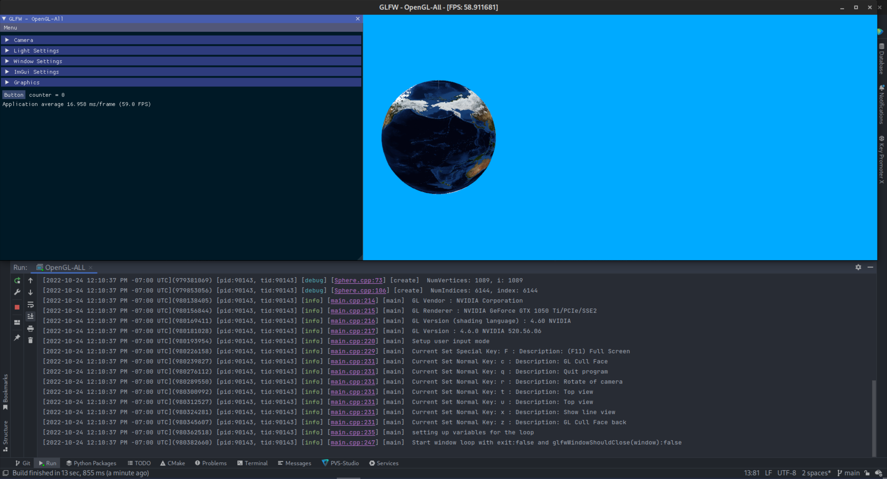

# OpenGL All

A place to put all I lean of OpenGL but using more of a Cpp format instead of C

## Directory structure

- Quick Documentation about this repo [(README.md)](README.md) 
- Source directory [(src)](src)
  - Start of the program [(main.cpp)](src/main.cpp)
  - Methods I need [(OpenGLHelperMethods.cpp)](src/OpenGLHelperMethods.cpp)
  - Sphere Class [(Sphere.cpp)](src/Sphere.cpp)
  - Cube Class [(Cube.cpp)](src/Cube.cpp)
  - Working on a Wire OBJ Model Loader [(ModelLoader.cpp)](src/ModelLoader.cpp) 
- Resources folder [(res)](res)
  - icon folder
    - ...
  - models
    - a simple wireframe box file [(box.obj)](res/models/box.obj)
  - shaders
    - Fragment Shader [(shader.frag)](res/shaders/shader.frag)
    - Vertex Shader [(shader.vert)](res/shaders/shader.vert)
  - textures
    - earth [(Earth.jpg)](res/textures/Earth.jpg)
    - ...
- Exernal Libraries [(exernalLibraries)](exernalLibraries)
  - glew (opengl)
  - glfw (window manager)
  - glm (graphic math lib)
  - imgui (make a gui)
  - spdlog (logging lib)
  - stb (image lib)
- Header files [(include)](include)
  - ...
- Test sources [(test)](test)
  - TODO: add tests